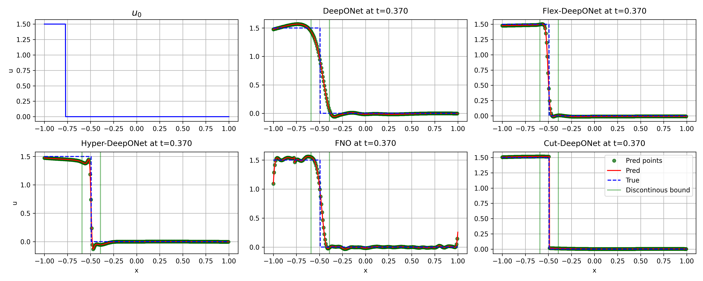

# Smooth Piecewise Cutting for Neural Operator to Handle Discontinuities and Sharp Transitions

This repository is the official implementation of [Smooth Piecewise Cutting for Neural Operator to Handle Discontinuities and Sharp Transitions](https://arxiv.org/abs/2605.19823) by Ha Dang, Sebastian Schmidt and Jürgen Hesser.



## Directory Structure

Each folder represents a problem demonstrated in the paper, with the following structure:

```text
inviscid_burgers/
├── checkpoints/
├── data/
├── 1_Evaluation_with_TestSet.ipynb
├── DeepONet.ipynb
├── flexDeepONet.ipynb
├── HyperDeepONet.ipynb
├── FNO.ipynb
├── Cut_DeepONet.ipynb
└── CuttingNet.ipynb
```

Note: The `inviscid_burgers`, `linear_advection`, and `parsimonious_model` folders contain experiments comparing the performance of Cut-DeepONet to other methods. They have the same structure.

## Installation & Use Guide

### Setting up
- Install the requirements, run: ```pip install -r requirements.txt```
- Create `checkpoints` folder

### Dataset & Pre-trained models
- You can create your own dataset using the files in the `data` folder, or you can download the dataset from the link below and copy it into the `data` folder.
- To save training time, you can download the pretrained models here. These models were trained using the included dataset; copy them into your `checkpoints` folder.

Note: [Dataset and Pretrained Models](https://drive.google.com/file/d/1pVaBeqivcpe4wEYlQbGx9cPzBmBUcnLX/view?usp=sharing) is the link to download the dataset and pretrained models.

### Training 

To retrain the models presented in the paper, run all cells in the corresponding training notebooks for each model: `DeepONet.ipynb`, `flexDeepONet.ipynb`, `HyperDeepONet.ipynb`, `FNO.ipynb`, and `Cut_DeepONet.ipynb` (`Cut_DeepONet.ipynb` requires training `CuttingNet.ipynb` first).

### Evaluation

If you already have the checkpoints, or if you download the pretrained models from the link below, you can run `1_Evaluation_with_TestSet.ipynb`. You can replace the test dataset at the beginning of the notebook. At the end of the evaluation, a plot comparing all methods will be generated


## Cite this work

If you use this code for academic research, you are encouraged to cite the following paper:

```
@misc{dang2026smoothpiecewisecuttingneural,
      title={Smooth Piecewise Cutting for Neural Operator to Handle Discontinuities and Sharp Transitions}, 
      author={Ha Dang and Sebastian Schmidt and Juergen Hesser},
      year={2026},
      eprint={2605.19823},
      archivePrefix={arXiv}, 
}
```

## Questions

To get help on how to use the data or code, simply open an issue in the GitHub "Issues" section.

## License

[](https://creativecommons.org/licenses/by/4.0/)